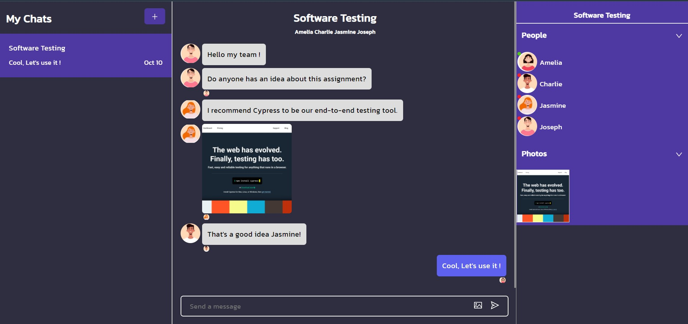

# Chat Web Application

Chat Web Application provides basic chatting feature based on Chat Engine. You can login, create/delete group, invite/remove members and chat with all members in the group.



## Technologies


## Chat Engine

Chat UI Kit and Rest API for website or app which enable you to create chat app. Chat Engine use web socket behind the scene. [Visit official website here](https://chatengine.io/).

## Prepare & Installation

1. Create react app

   ```
   npx create-react-app chat-app
   ```

2. install axios, ant design icon and react-chat-engine

   ```
   npm install axios @ant-design/icons react-chat-engine
   ```

3. install tailwindcss, [see how to install tailwind in create-react-app here](https://tailwindcss.com/docs/guides/create-react-app).

## Chat Engine

First, Go to [Chat Engine Website](https://chatengine.io/) and sign up for creating a project. Then, create user and chat.

```js
// app.js
import { ChatEngine } from 'react-chat-engine';
// modify chat feed
import ChatFeed from './components';

function App() {
  return (
    <ChatEngine
      height="100vh"
      projectID={process.env.REACT_APP_PROJECT_ID}
      userName={process.env.REACT_APP_USERNAME}
      userSecret={process.env.REACT_APP_SECRET}
      renderChatFeed={(chatAppProps) => <ChatFeed {...chatAppProps} />}
    />
  );
}

export default App;
```

Chat Engine provides UI customization and APIs for creating chat app. In this project, I create some important features:

- Login (Authentication)
- Chat group
- Chat Feed - can send both messages and images to the members in the group.
- Permission - divided into two categories
  - Admin - can chat, add members, delete members and delete group
  - Member - can only chat
